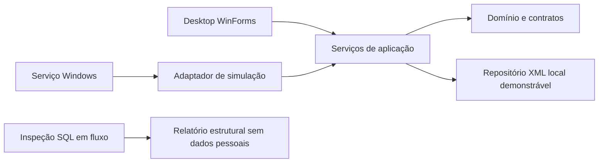

# Arquitetura

Estado: proposta para implementação incremental.

C# e APIs do .NET Framework 4.7.2 são o alvo inicial. O compilador instalado e os reference assemblies 4.7.2 permitem compilar com /nostdlib contra o alvo explícito. Validação no sistema mínimo permanece obrigatória.

Domínio define cliente/local, conta, contato, equipamento, zona/partição, evento, ocorrência, ação, usuário e auditoria. Esses modelos pertencem ao sistema novo, não são tabelas presumidas do BYKOM.

Evento conserva origem, instante de recepção e conteúdo bruto. Ocorrência representa o trabalho operacional. Assumir atendimento é alteração concorrente controlada. ACK só existirá no adaptador real, conforme documentação confirmada.

Persistência local deve serializar atualização entre processos, gravar arquivo temporário e substituir atomicamente o principal, com recuperação explícita. Escopo da exclusão: uma máquina. Não prometer transação distribuída, tolerância a falha de disco ou escala multiestação.

Destino de produção: repositório de banco próprio e migrações versionadas, versão do banco e conector após matriz de compatibilidade. Não gravar em tabelas de produção BYKOM.
