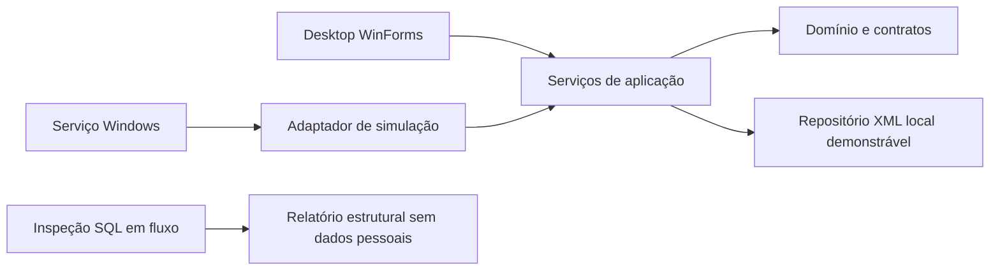

# Arquitetura

Estado: demonstrador implementado; producao pendente. Revisao 2026-09-16. Mapa completo em [ORGANOGRAMA.md](ORGANOGRAMA.md).

C# e APIs do .NET Framework 4.7.2 são o alvo inicial. O compilador instalado e os reference assemblies 4.7.2 permitem compilar com /nostdlib contra o alvo explícito. Validação no sistema mínimo permanece obrigatória.

Models contem Client, Incident, LegacyEvent, Session e AuditEntry. Contatos, equipamentos e zonas ainda sao texto no cadastro. Store concentra regras e autorizacao; nao existe API HTTP. A UI chama Store diretamente. Esses modelos nao sao tabelas presumidas do BYKOM.

ReceiveSimulation conserva instante de recepcao e origem opcional, deduplica MessageId e cria Incident diretamente. Raw e texto SIMULATION reconstruido, nao bytes SG3. Separar evento tecnico de ocorrencia ainda e trabalho futuro. Atendimento segue New -> InProgress -> Closed, com Claim concorrente controlado e alteracoes pelo responsavel ou Admin. ACK so existira no adaptador real.

XmlRepository carrega o documento completo sob lock por arquivo, grava temporario, Flush(true) e substitui o principal com .bak. Escopo: uma maquina. Leitura/regravacao integral limita escala. Auditoria acompanha alteracoes XML, mas nao resiste a edicao direta; exportacao CSV e auditoria sao gravacoes separadas. Sem transacao distribuida ou multiestacao.

Receiver varre inbox a cada segundo; persiste antes de mover para processed. Entrada invalida vai para quarantine; falhas de I/O preservam mensagens pendentes. Nao ha socket SG3. O importador Python le SQL sem executar comandos, cria destino novo e separa LegacyHistory de alarmes ativos. Contas BYKOM-ORDER_ID sao exclusivas do teste.

Destino de produção: repositório de banco próprio e migrações versionadas, versão do banco e conector após matriz de compatibilidade. Não gravar em tabelas de produção BYKOM.
