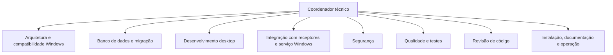

# Organograma

Funções detalhadas em agentes/. Papéis são responsabilidades técnicas, não afirmações de experiência profissional ou certificação. Agentes efetivamente despachados serão registrados no histórico; várias funções podem pertencer ao mesmo agente, sem alegação de revisão independente nesse caso.

Dependências: arquitetura estabelece contratos antes de desktop/serviço; banco depende do legado para migração; integração real depende de protocolo; qualidade e revisão examinam entrega integrada; operação publica instruções após resultados reais. Arquivos têm proprietário exclusivo durante edição concorrente.
