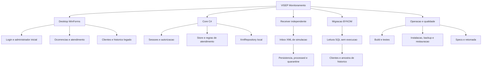
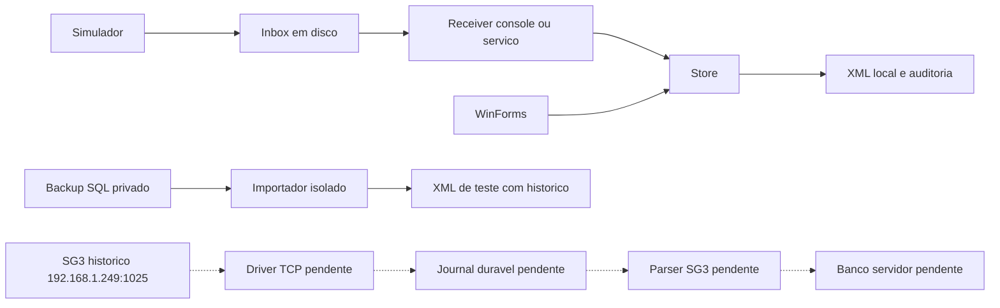
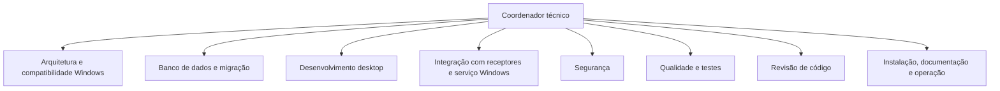

# Organograma do projeto VISEP

Revisao: 2026-09-16. Base demonstravel existente; integracao SG3 e banco multiestacao pendentes. Estados em [specs/README.md](specs/README.md).

## Componentes e fluxo



## Integracao atual e futura



Linhas pontilhadas representam trabalho futuro. O Receiver atual nao abre socket SG3. O sentido dos eventos SG3 para driver nao altera o papel TCP inferido: a central inicia a conexao. O launcher de teste encerra o receptor junto da UI; operacao independente utiliza console/servico separado.

## Mapa de responsabilidades

| Area | Arquivos principais | Specs | Situacao |
|---|---|---|---|
| Compatibilidade | scripts/Build.ps1 | 001 | Build local; Server 2008 R2 nao homologado |
| Arquitetura e dominio | src/Core/Models.cs, Store.cs, XmlRepository.cs | 002, 003 | Local; sem API/banco servidor |
| Cadastro e interface | src/Desktop/Program.cs | 004 | Contatos/zonas em texto |
| Recepcao simulada | src/Receiver/ReceiverProgram.cs | 005 | Inbox, retentativa, dedup e quarentena |
| Automacao SG3 | docs/INTEGRACAO_SG_SYSTEM_III.md | 006 | Endpoint identificado; protocolo pendente |
| Atendimento | Store.Claim, AddAction, Close | 007 | New -> InProgress -> Closed |
| Seguranca | PasswordSecurity.cs, Store.Auth, Install.ps1 | 008 | PBKDF2, perfis e fronteira local |
| Consultas e exportacao | Store.LegacyHistory, ExportCsv, Desktop | 009 | Historico de teste e CSV |
| Instalacao/recuperacao | Install.ps1, Backup.ps1, Restore.ps1 | 010 | SCM/SO alvo pendentes |
| Qualidade | tests/, scripts/Build.ps1 | 011 | Cobertura nao medida |
| Legado | src/Migration/import_legacy.py, sql_dump.py | 003 | Mapeamento real nao homologado |

## Organizacao das pastas

```text
README.md                 entrada de retomada
src/Core/                 dominio, regras, autenticacao e XML
src/Desktop/              interface WinForms
src/Receiver/             simulacao e host Windows Service
src/Migration/            inspector C# e importador Python
scripts/                  build, operacao, backup e migracao
tests/                    unidade, integracao e E2E desktop
docs/specs/               11 especificacoes e matriz de estado
docs/evidencias/           evidencias e manifesto de insumos
Inventario/Modelo/        referencia MIT; nao integra runtime
Inventario/               DOCX publicado; demais insumos privados
tools/                    contexto auxiliar e artefatos locais
build/                    binarios reproduziveis, ignorados
data/                     dados de execucao privados, ignorados
```

## Papeis tecnicos



Funções detalhadas em agentes/. Papéis são responsabilidades técnicas, não afirmações de experiência profissional ou certificação. Agentes efetivamente despachados serão registrados no histórico; várias funções podem pertencer ao mesmo agente, sem alegação de revisão independente nesse caso.

Dependências: arquitetura estabelece contratos antes de desktop/serviço; banco depende do legado para migração; integração real depende de protocolo; qualidade e revisão examinam entrega integrada; operação publica instruções após resultados reais. Arquivos têm proprietário exclusivo durante edição concorrente.
